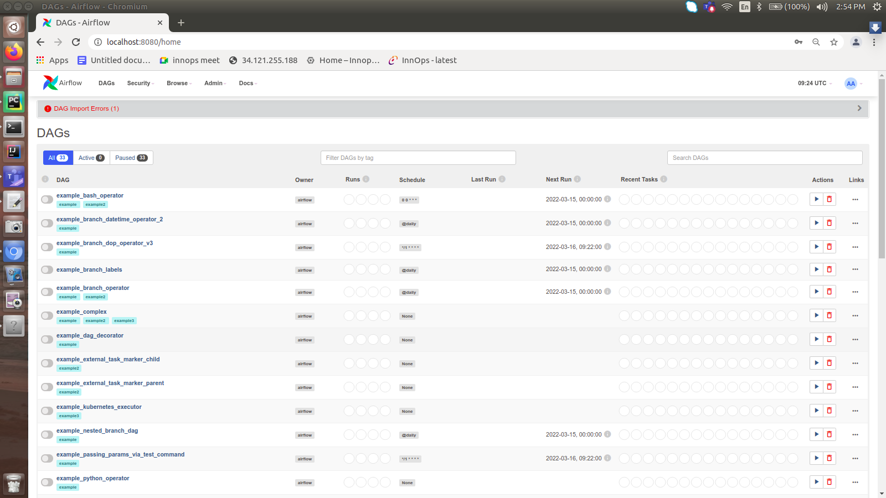

# Apache airflow docker
#### Reference : https://airflow.apache.org/docs/apache-airflow/stable/start/docker.html

### Check Docker version

    csk@csk-ai-revolution:~/Sathish/Softwares/apache airflow$ sudo docker run --rm "debian:buster-slim" bash -c 'numfmt --to iec $(echo $(($(getconf _PHYS_PAGES) * $(getconf PAGE_SIZE))))'

### Download yaml file for airflow
    csk@csk-ai-revolution:~/Sathish/Softwares/apache airflow$ curl -LfO 'https://airflow.apache.org/docs/apache-airflow/2.2.4/docker-compose.yaml'

## Initialization
### create volume dirs for dag, logs and plugins
    csk@csk-ai-revolution:~/Sathish/Softwares/apache airflow$ mkdir -p ./dags ./logs ./plugins
### env variables
    csk@csk-ai-revolution:~/Sathish/Softwares/apache airflow$ echo -e "AIRFLOW_UID=$(id -u)" > .env

## Initialize database
    csk@csk-ai-revolution:~/Sathish/Softwares/apache airflow$ sudo docker-compose up airflow-init

## Run apache airflow
    csk@csk-ai-revolution:~/Sathish/Softwares/apache airflow$ sudo docker-compose up -d

## Airflow CLI
    csk@csk-ai-revolution:~/Sathish/Softwares/apache airflow$ curl -LfO 'https://airflow.apache.org/docs/apache-airflow/2.2.4/airflow.sh'
    csk@csk-ai-revolution:~/Sathish/Softwares/apache airflow$ chmod +x airflow.sh
    csk@csk-ai-revolution:~/Sathish/Softwares/apache airflow$ 

## Clean up
    csk@csk-ai-revolution:~/Sathish/Softwares/apache airflow$ sudo docker-compose down --volumes --rmi all
    csk@csk-ai-revolution:~/Sathish/Softwares/apache airflow$ sudo docker-compose down --volumes --remove-orphans

## Check in browser : Apache Airflow UI

    localhost:8080
    username : airflow
    password : airflow
    

DAG page

### Running other docker file

	csk@csk-ai-revolution:~/PycharmProjects/git/apache_airflow$ sudo docker build -f dags/docker/Dockerfile -t docker_image_task .

